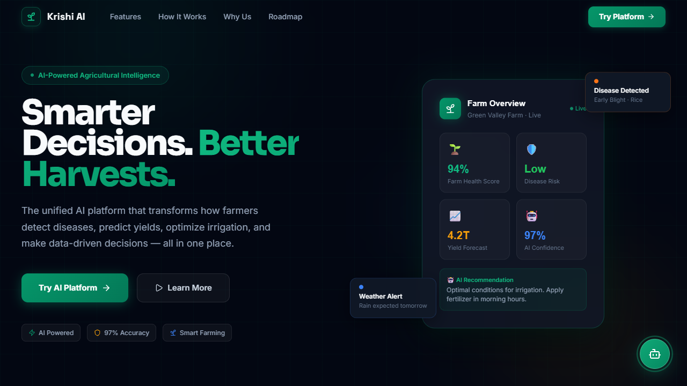
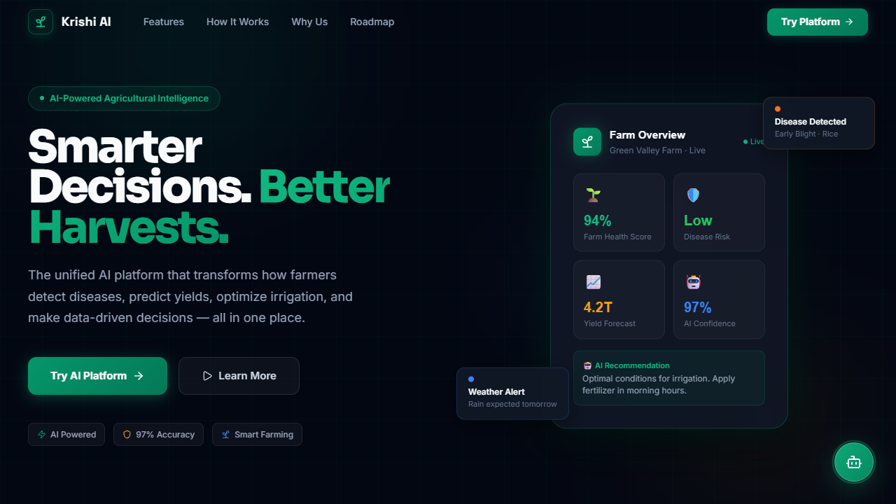
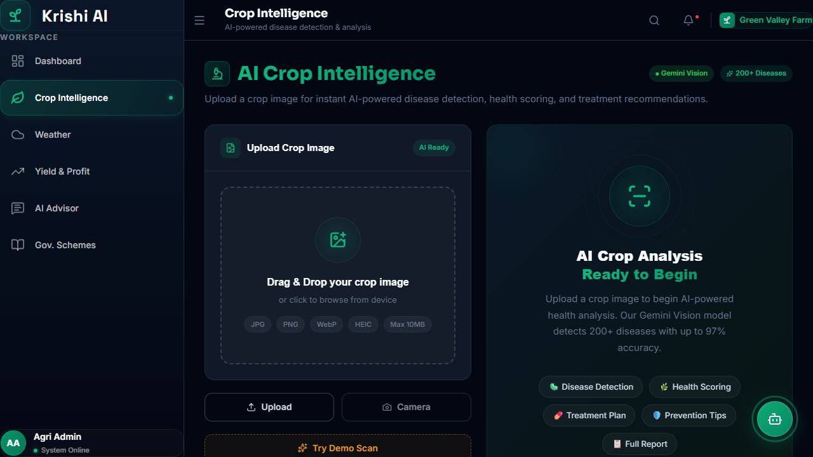
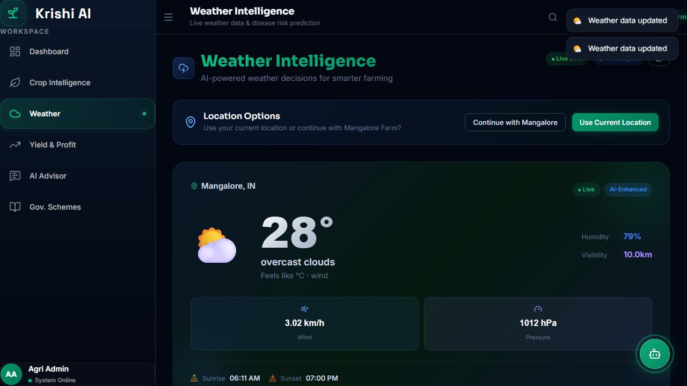
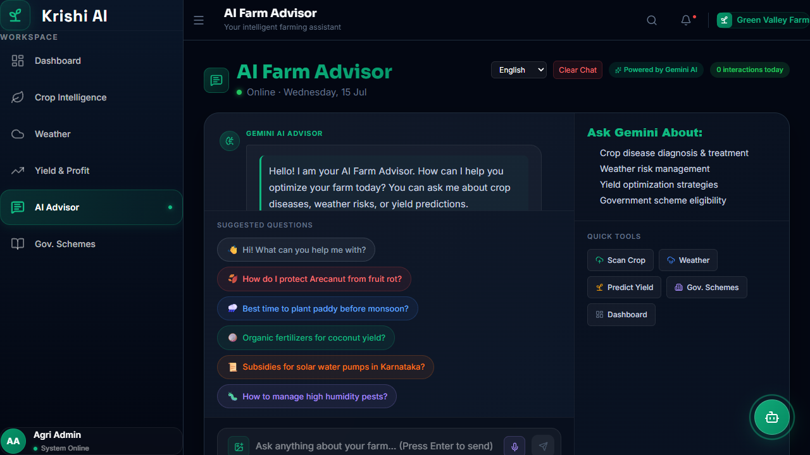
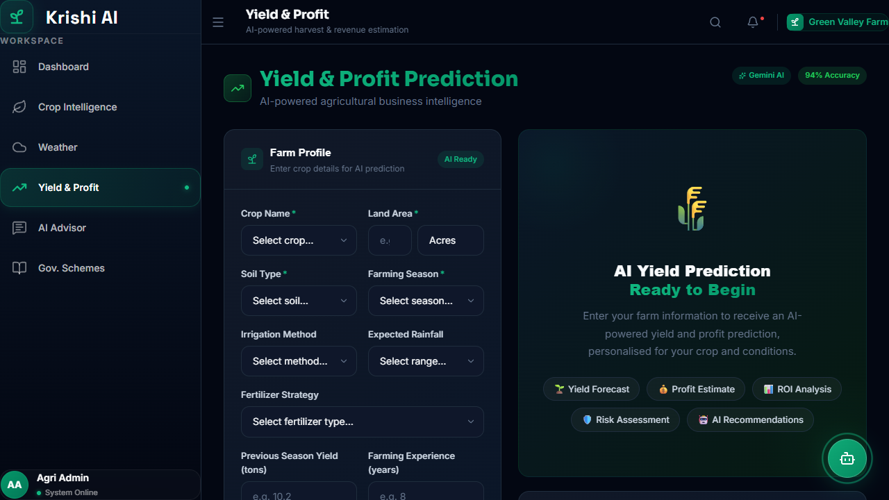
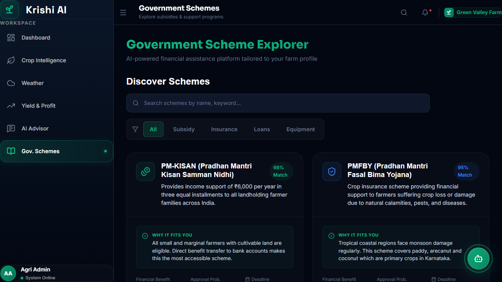
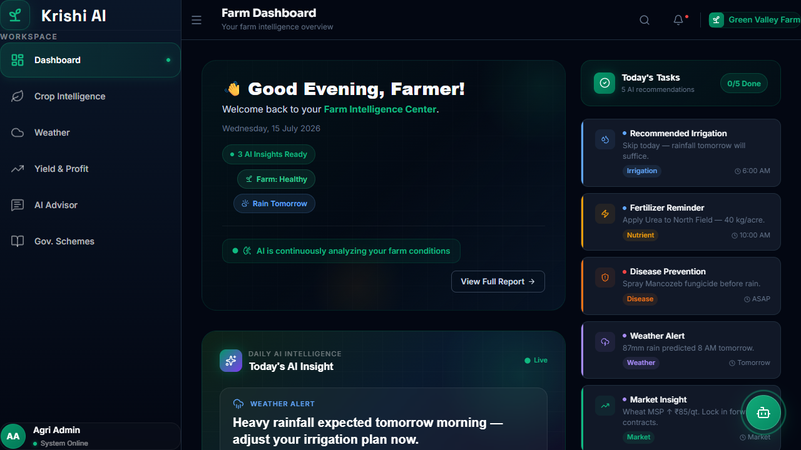
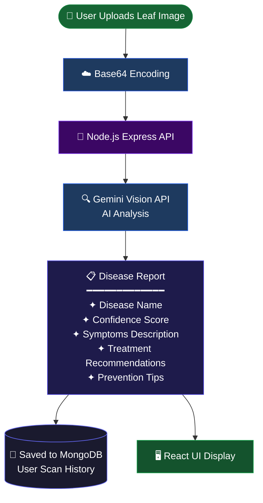
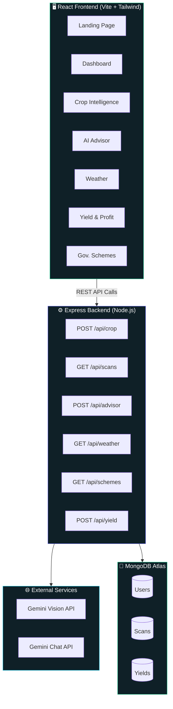

<div align="center">


<br/>


<br/>

<p>
  
  
  
  
  
</p>

<p>
  <a href="https://frontend-dusky-one-eg13yl5mxp.vercel.app" target="_blank">
    
  </a>
  &nbsp;
  <a href="https://github.com/abhishek-ms-01/agri-intelligence-platform/stargazers">
    
  </a>
  &nbsp;
  <a href="https://github.com/abhishek-ms-01/agri-intelligence-platform/issues">
    
  </a>
</p>

<br/>


<br/>

> ### _Empowering farmers with AI — detect diseases, predict yields, and grow smarter._

<br/>

</div>

---

## 🌱 What is Krishi AI?

**Krishi AI** is an advanced, full-stack AI-powered agricultural decision-support platform designed to bridge the gap between traditional farming and modern technology. It empowers farmers to detect crop diseases, predict yields, analyze weather patterns, and discover financial aid through an incredibly intuitive, premium dashboard.

The platform provides a **complete digital ecosystem** for modern agriculture, integrating:

- 🔬 Real-time crop disease detection via **Google Gemini Vision AI**
- 🤖 Conversational AI farming advisor powered by **Gemini LLM**
- 🌦 Agricultural-specific weather forecasting and disaster alerts
- 📈 Data-driven crop yield prediction and profitability analysis
- 🏛 Smart matching for government agricultural schemes and subsidies

```
📸 Upload a leaf image  →  🧠 AI detects the disease  →  💊 Get treatment in seconds
```

> No expertise required. No complicated setup. Just point, scan, and grow.

---

## 📸 Platform Screenshots

<div align="center">

<table>
  <tr>
    <td align="center" width="50%">
      
      <br/><br/><b>🏠 Landing Page — Smarter Decisions. Better Harvests.</b>
    </td>
    <td align="center" width="50%">
      
      <br/><br/><b>⚙️ How It Works — AI Workflow</b>
    </td>
  </tr>
  <tr>
    <td align="center" width="50%">
      
      <br/><br/><b>🌿 Crop Intelligence — AI Disease Detection</b>
    </td>
    <td align="center" width="50%">
      
      <br/><br/><b>🌦 Weather Intelligence — Live Forecast</b>
    </td>
  </tr>
  <tr>
    <td align="center" width="50%">
      
      <br/><br/><b>🤖 AI Farm Advisor — Powered by Gemini</b>
    </td>
    <td align="center" width="50%">
      
      <br/><br/><b>📈 Yield & Profit Prediction</b>
    </td>
  </tr>
  <tr>
    <td align="center" width="50%">
      
      <br/><br/><b>🏛 Government Scheme Explorer</b>
    </td>
    <td align="center" width="50%">
      
      <br/><br/><b>📊 Analytics Dashboard</b>
    </td>
  </tr>
</table>

</div>

---

## ✨ Core Features

<div align="center">

|           Module            | Capability                                                   |    Powered By     |
| :-------------------------: | ------------------------------------------------------------ | :---------------: |
|  🌿 **Disease Detection**   | Upload leaf → instant AI diagnosis with full treatment plan  | Gemini Vision AI  |
|     🤖 **Agri Advisor**     | 24/7 farming chatbot for pesticide, fertilizer & crop advice | Google Gemini LLM |
| ⛅ **Weather Intelligence** | 7-day forecast + agricultural disaster alerts                |    Custom API     |
|   📈 **Yield Prediction**   | Profit calculator, yield projections, and data analytics     |  Data Analytics   |
|     🏛 **Gov. Schemes**     | PM-KISAN, PMFBY, and financial scheme discovery              |  React & Framer   |

</div>

<br/>

### 🌿 AI Crop Disease Detection

> Upload any crop leaf image — get a precise diagnosis instantly.

- **Drag-and-drop** or camera capture on any device
- **Gemini Vision AI** evaluates the crop's health dynamically
- Returns: disease name, confidence score, symptoms, treatment plan, and prevention tips

### 🤖 AI Agricultural Advisor

> Your personal farming expert — available 24/7.

- Ask anything: disease ID, pesticide selection, fertilizer ratios, irrigation timing
- **Context-aware** responses based on real-world agronomy data
- Clean, chat-like interface powered by **Google Gemini**

### 📈 Yield & Profit Optimizer

> Plant smarter. Earn more. Waste less.

- Calculate expected crop yield based on farm size, soil type, and current climate conditions
- Helps farmers plan logistics, storage, and market sales before the harvest even begins

### 🏛 Government Scheme Explorer

> Never miss a subsidy or support program again.

- Filters national and state-level agricultural schemes based on the farmer's specific profile
- Unlocks hidden funding, subsidies, and insurance policies to protect the farmer's livelihood

---

## 🔁 Disease Detection Workflow



---

## 🏗 System Architecture



---

## 🧠 Tech Stack

<div align="center">

**Frontend**


**Backend**


**AI & Hosting**


</div>

---

## 📁 Folder Structure

```
agri-intelligence-platform/
│
├── backend/                       # Node.js & Express API
│   ├── src/
│   │   ├── config/                # Database configurations
│   │   ├── controllers/           # Route logic (advisor, crop, yield, etc.)
│   │   ├── middleware/            # Custom Express middlewares
│   │   ├── models/                # Mongoose Database Schemas
│   │   ├── routes/                # Express API Route definitions
│   │   └── services/              # Gemini AI API integration
│   ├── package.json               # Backend dependencies
│   ├── server.js                  # Express Application Entry Point
│   └── vercel.json                # Vercel Serverless Config
│
├── frontend/                      # React & Vite Application
│   ├── public/                    # Static assets
│   ├── src/
│   │   ├── api/                   # Axios API client functions
│   │   ├── assets/                # Images and vectors
│   │   ├── components/            # Reusable UI Components
│   │   ├── pages/                 # Full Page Routes (Views)
│   │   ├── styles/                # Tailwind & Global CSS
│   │   ├── App.jsx                # Main React Router setup
│   │   └── main.jsx               # React DOM Rendering Entry
│   ├── package.json               # Frontend dependencies
│   ├── vercel.json                # SPA Routing config for Vercel
│   └── vite.config.js             # Vite build configuration
│
├── .gitignore                     # Global Git ignore rules
└── README.md                      # Project Documentation
```

---

## 🚀 Installation & Setup

### Prerequisites

| Tool    | Min Version | Download                            |
| ------- | :---------: | ----------------------------------- |
| Node.js |    v18+     | [nodejs.org](https://nodejs.org/)   |
| Git     |   Latest    | [git-scm.com](https://git-scm.com/) |

### Step 1 — Clone the Repository

```bash
git clone https://github.com/abhishek-ms-01/agri-intelligence-platform.git
cd agri-intelligence-platform
```

### Step 2 — Set Up Environment Variables

Create a `.env` file in the **backend** folder:

```env
PORT=5000
MONGODB_URI=mongodb+srv://<user>:<password>@cluster0.xxxxx.mongodb.net/cropcare
GEMINI_API_KEY=AIzaSy_your_gemini_api_key_here
NODE_ENV=development
```

### Step 3 — Run the Application

```bash
# Terminal 1 — Start backend server
cd backend
npm install
npm run dev

# Terminal 2 — Start frontend dev server
cd frontend
npm install
npm run dev
```

Open your browser to `http://localhost:5173`

---

## 📖 API Documentation

### Detect Disease

```http
POST /api/crop/analyze
Content-Type: application/json
```

**Response:**

```json
{
  "disease": "Tomato Late Blight",
  "confidence": 0.94,
  "symptoms": ["Dark brown lesions", "White fuzzy mold"],
  "treatment": "Apply copper-based fungicide immediately",
  "prevention": "Improve air circulation"
}
```

### AI Chat Assistant

```http
POST /api/advisor/chat
Content-Type: application/json
```

**Response:**

```json
{
  "response": "For powdery mildew on wheat, I recommend applying a sulfur-based fungicide during the early morning..."
}
```

---

## 📊 Platform Modules

<div align="center">

|  #  | Module               | Route                    | Description                                       |
| :-: | -------------------- | ------------------------ | ------------------------------------------------- |
|  1  | 🏠 Landing Page      | `/`                      | Platform intro, features, and call-to-action      |
|  2  | 📊 Dashboard         | `/app`                   | Main analytics and recent activity feed           |
|  3  | 🌿 Crop Intelligence | `/app/crop-intelligence` | Upload leaf → instant AI diagnosis                |
|  4  | 🌦 Weather           | `/app/weather`           | Forecast and crop disease risk analysis           |
|  5  | 📈 Yield & Profit    | `/app/yield`             | Crop yield predictor and profitability calculator |
|  6  | 🤖 AI Advisor        | `/app/advisor`           | Gemini-powered farming chatbot                    |
|  7  | 🏛 Gov. Schemes      | `/app/schemes`           | Agricultural scheme explorer                      |

</div>

---

## 🎯 Who Is Krishi AI For?

```
🌾  Small & Marginal Farmers    →  Expert-level disease diagnosis, completely free
📚  Agriculture Students        →  Learn plant pathology with real AI feedback
🏢  AgriTech Startups           →  Integrate the detection API into your product
🌐  Smart Farming Systems       →  Combine with IoT sensors for predictive alerts
🌍  NGOs & Government Bodies    →  Scale farmer advisory services at low cost
```

---

## 🔮 Roadmap

<div align="center">

| Status | Feature                                                         |
| :----: | --------------------------------------------------------------- |
|   🔜   | 📱 Native mobile app (React Native) for offline-capable farms   |
|   🔜   | 🛸 Drone crop scanning for field-scale disease mapping          |
|   🔜   | 🛰 Satellite NDVI monitoring for large-scale crop health        |
|   🔜   | 🗣 Multilingual voice assistant (Hindi, Tamil, Telugu, Marathi) |
|   🔜   | 📡 SMS disease risk alerts — no internet connection required    |

</div>

---

## 🤝 Contributing

Contributions make the open-source community extraordinary. All contributions are **warmly welcomed!**

```bash
# 1. Fork this repository via the GitHub UI
# 2. Clone your fork locally
git clone https://github.com/abhishek-ms-01/agri-intelligence-platform.git
# 3. Create a feature branch
git checkout -b feature/amazing-feature
# 4. Commit your changes
git commit -m "feat: add amazing feature"
# 5. Push and Open a Pull Request
```

---

## 📄 License

Distributed under the **MIT License**. Free to use, modify, and distribute with attribution.

---

## 👨‍💻 Author

<div align="center">

<br/>

_Full-Stack AI Developer · AgriTech Builder_

<br/>

[](https://github.com/abhishek-ms-01)
&nbsp;&nbsp;
[](https://frontend-dusky-one-eg13yl5mxp.vercel.app)

<br/>

</div>

---

<div align="center">


<br/>

**Built with 🌱 love — for every farmer working hard in the field**

_If Krishi AI helped or inspired you, please give it a_ ⭐ _on GitHub — it truly means everything!_

<br/>


</div>
